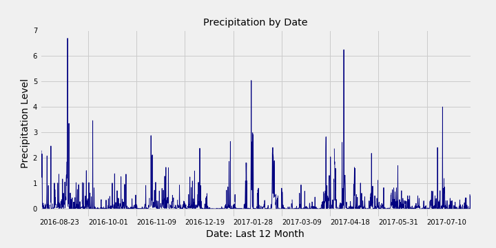
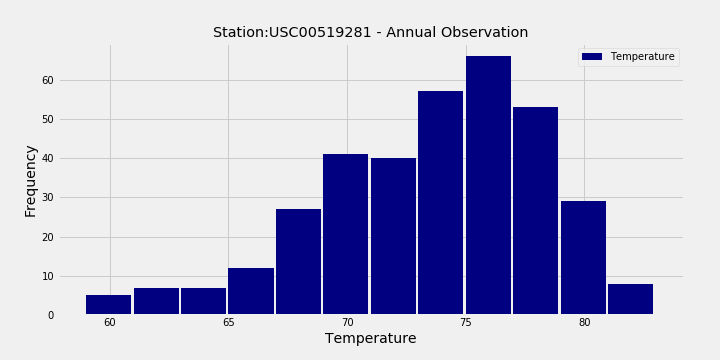
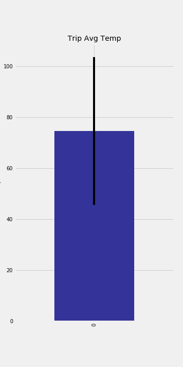

# sqlalchemy-challenge

## SqlAlchemy Homework - Surfs Up!
* Due on Thursday: November 21, 2019

### Task: You need to do some climate analysis on the area. The following outlines what you need to do:

1. Climate Analysis and Exploration
* Precipitation Analysis - climate_starter.ipynb

* Station Analysis - climate_starter.ipynb

2. Climate App - app.py
Flask api routes

### Bonus (Optional)
* Temperature Analysis I
* Temperature Analysis II

* Daily Rainfall Average

## Purpose: use sqlalchemy, connect to sql database, flask api, pandas.